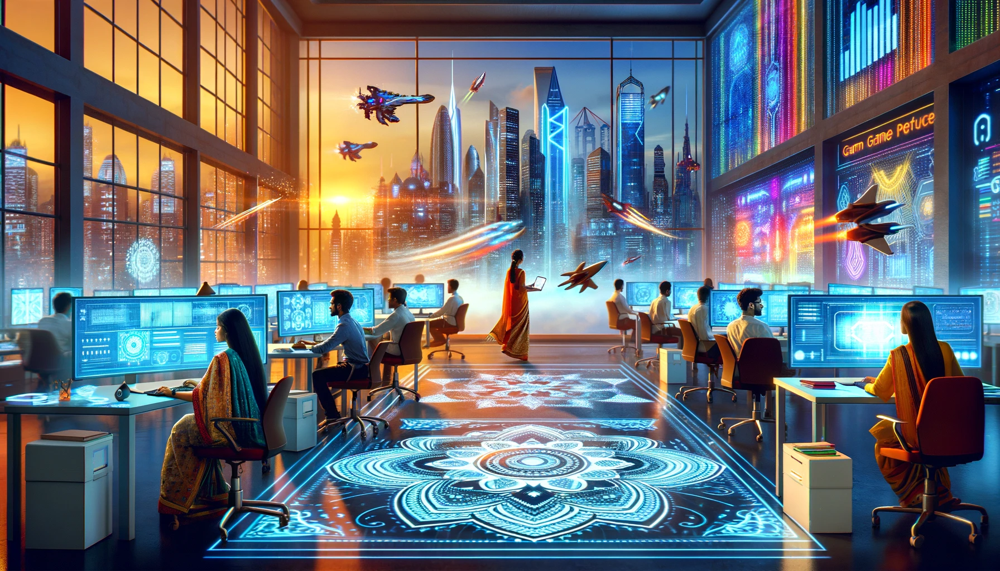
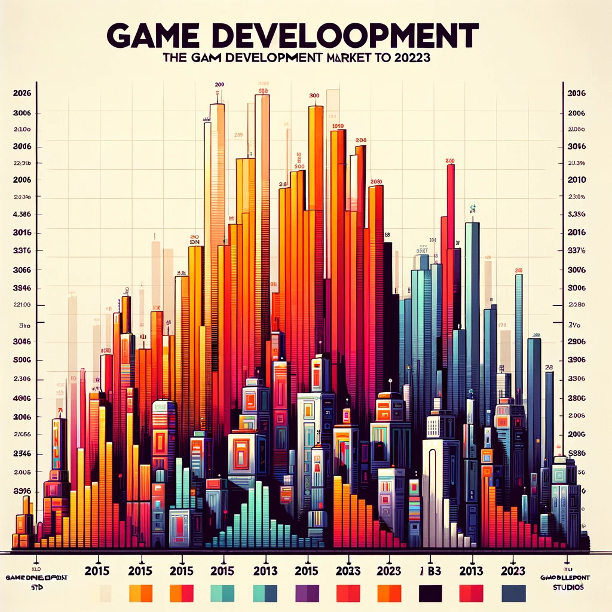
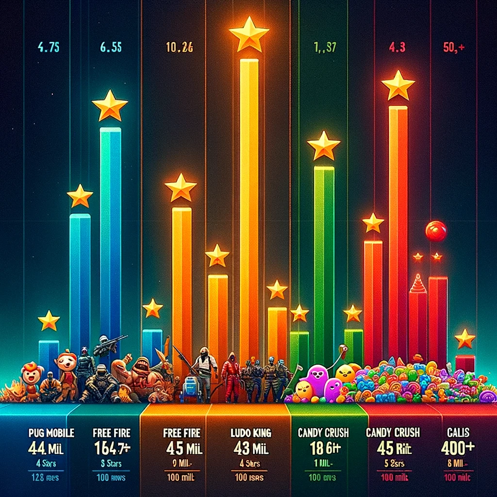
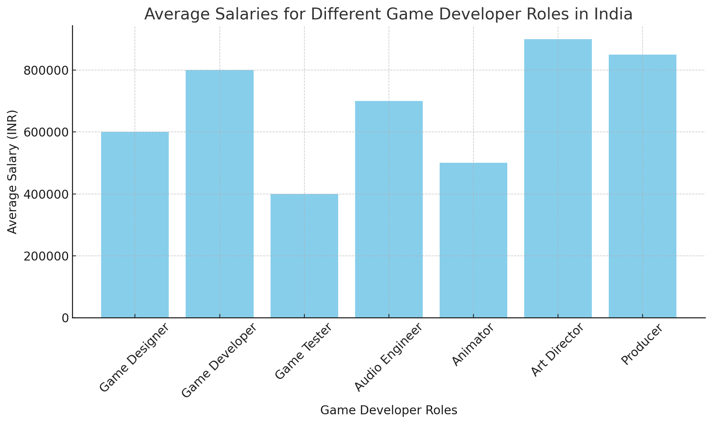

# The Future of Game Development in India

#### What is Game Development?
Game Development is the __art of creating games__ and describes the design, development and release of a game. It may involve **concept generation, design, build, test and release**. While you create a game, it is important to think about the game mechanics, rewards, player engagement and level design.

#### What should I learn to became a game developer?
- Creative vision.
- Atleast one programming language (preferred C++ or C#).
- Knowledge of design patterns for designing the best UI for the game.
- Story telling each and every game must and should a story back drop to related it with users.

#### Will game development will have future in India?
Yes, the future of game development in India looks promising. India is the world's largest mobile gaming market by app downloads, with 373 million online mobile gamers. The gaming industry is expected to grow, with some experts predicting it could reach $3.5 billion by 2024 and Rs 231 billion by 2025

### Game development market in India.

**Source: Niko**

**Source: Dall.e**      

### Some popular games in India
Game	| Ratings |	Downloads|	Type
--- | --- | --- | ---
PUBG Mobile |	4.5 Stars | 5 Mil Reviews	100 Mil+|	Action
Free Fire|	4.3 Stars |18 Mil Reviews	100 Mil +|	Action
Ludo King|	4.2 Stars | 9 Mil Reviews	500 Mil +|	Board
Candy Crush Saga|	4.4 Stars | 34 Mil Reviews	1000 Mil +|	Casual
Clash of Clans|	4.5 Stars | 54 Mil Reviews	500 Mil +|	Strategy

**Source: Dall.e**

### Some companies in India
1. **__Orion Infosolutions__**: Orion InfoSolutions is a certified Mobile Game Development Company in Jaipur, India. We deliver Mobile games, eCommerce development, enterprise software development, and all other EMERGING TECHNOLOGIES LIKE Blockchain Development, AR/VR, Machine Learning, and AI.
 - [Website](https://www.orioninfosolutions.com/) [LinkedIn](https://www.linkedin.com/company/orion-infosolutions/) [Careers](https://www.orioninfosolutions.com/career.php)

2. **__Juego Studios__**: It is a game development outsourcing studio that started as a game design company in 2013 but has now expanded to a fully-fledged technology venture that employs game developers, AR/VR specialists, IoT experts, designers, artists, and animators. The studio is known for games with a strong artistic vision, great visuals, and immersive gameplay. School of Dragon, Ghostbusters: Spirits Unleashed, Tree World, and Baby Einstein are games developed by Jeugo.  
- [Website](https://www.juegostudio.com/game-development-services) [LinkedIn](https://www.linkedin.com/company/juego-studios/) [Careers](https://www.juegostudio.com/careers)

3. **__Abhiwan Technology__**: With a global reach, we take pride in delivering intelligent and pioneering services to a multitude of clients worldwide. Boasting over 5+ years of extensive experience in crafting mobile and web applications, our team comprises highly skilled professionals, including developers, IT specialists, marketers, unity developers, and passionate tech enthusiasts.     
 At ABHIWAN, we stand at the forefront, offering solutions in Metaverse, Blockchain, NFT Marketplace, Defi, Play to Earn, Casino Games, Virtual Reality, Augmented Reality, Mixed Reality, Game Development, Web Development, Mobile Apps Development, Archviz, AI, Chatbot, and Machine Learning.

- [Website](https://www.abhiwan.com/) [LinkedIn](https://www.linkedin.com/company/abhiwantechnology/) [Careers](https://www.abhiwan.com/career)

### Game developers Roles and Salaries

**Source:     
PayScale: PayScale India    
Glassdoor: Glassdoor India**   

### RoadMap for GameDev
[RoadMap](https://roadmap.sh/game-developer) Check this out!

## All the best!! The game maker & game changer of your life.
